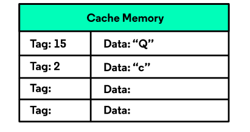
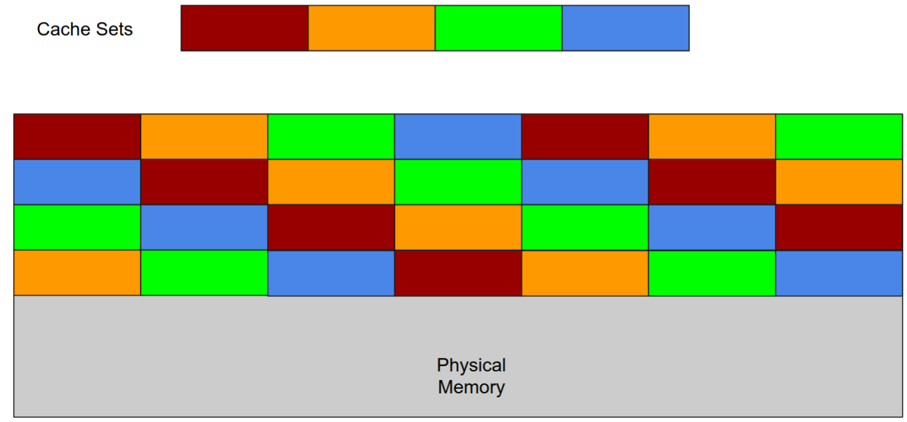

# CPU cache
处理器的缓存（cache）介于主存（DRAM）和处理器寄存器之间，这样的设计是为了减少内存 load 和 store 的延迟。Cache 的结构大致如下：


## Details about cache
Cache 的最小单位是 cache line，也是 block 。每一次处理器将内存数据或者指令加入缓存的大小都是 block size ，一般不存在小于 block size 的情况。Linux 下可以使用下面的命令查看 block size。

```
cat /sys/devices/system/cpu/cpu0/cache/index0/coherency_line_size
```

现在的体系结构一般使用 set-associative 的方式将内存映射在 cache 里。set 就是一组 cache line ，里面有若干个缓存行。对于 4-way set associative 的设计，一个 set 就是四个缓存行。 内存里所有的块都会被划分进不同的缓存组。



被映射在一个组的每个 memory block 都可以将数据加入到任意一个缓存行。例如4-way set associative ， 一个 memory block 可以有四种映射情况。

## tags
物理内存地址大致有三个部分，tag ，set，offset。 Offset 是用来寻址一个块内部不同字节的，set 也就对应映射的 cache set。tag 被用来区分同一个 cache set 中的 cache line 分别属于哪个内存块。

举个例子，假如一个物理内存的set 是 1, tag 是 2，那么处理器要判断这个块在不在缓存里要进行以下操作： 利用 set 找到对应的缓存组，随后在缓存组中查询是否有 cache line 的 tag 等于 2, 假如找到一个tag 是 2, 那么就是 cache hit （当然也涉及判断这个cache line 是不是 valid），处理器直接提取缓存的数据。如果找不到这个y tag ，处理器需要去内存寻找这个数据。

## Prefetcher
cache miss 依然是影响处理器性能的重要因素。要是频繁出现 cache miss ，处理器需要经常访问内存寻找数据，速度会慢很多。于是处理器加入了一些功能提前将数据加入缓存，这个模块一般被叫做 prefetcher 。

### Software prefetcher
有的编译器可能会加入一些 prefetcher 指令 例如：
```
// without prefetcher
for (int i=0; i<1024; i++) {
    array1[i] = 2 * array1[i];
}

// with prefetcher
for (int i=0; i<1024; i++) {
    prefetch (array1 [i + k]);
    array1[i] = 2 * array1[i];
}
```
### Stream prefetcher
这种 prefetcher 也许应用的比较广一些，具体是 prefetcher 会记录内存里访问的方向（可能是单个 page 内，不是非常确定，暂时不是很重要）。例如 `c = buffer [X]` 造成了一次 cache miss，这个 cache miss 会被 prefetcher window 记录，随后 `c = buffer [X + K]` ，又出现一次 cache miss， 最后再进行一次 `c = buffer [X + K + M]`, 此时 prefetcher 会大致判断内存的访问方向是加，那么比这个地址大的数据会被加入到 cache 中，被加入数据的大小是不确定的，不同的处理器设计不一定一样。

可以利用 flush reload 测信道探测 Stream pefetcher 的行为：
```
  pick = reloadbuffer[0];
		for(int i = 0 ; i < probe_size; i++){
			clock_init(&start);
			pick = reloadbuffer[i];
			clock_end(&end);
			time = get_clock(start, end);
    }
```


